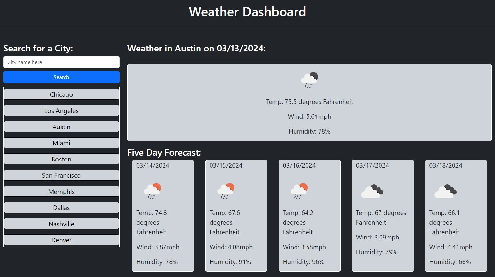

# Weather Dashboard Project

## Description
For this project, the goal was to create a weather dashboard that could provide a brief description of the current weather as well as a forecast for the weather reports over the next five days.  The information is drawn from the OpenWeather API upon entering a city name into the search bar and pressing the search button.  The city name is then stored to localstorage and populated in a recently searched list for ease of future access.

## Installation
N/A

## Usage
To use the webpage, follow [this link](https://njohnson2897.github.io/my-weather-dashboard/)

The following screenshot demonstrates what the page should look like in a browser:

Users first opening the page will not have the recently searched cities listed under the search bar on the left side.  These are populated upon refreshing the page after having searched for a city.  They function similarly to the search bar and if you would like to check the forecast in that city again in the near future, clicking on the recently searched city will populate the page with an updated forecast.

## Credits
Katie Redford, a tutor with the Northwestern Boot Camp, helped me to change the way I dynamically add forecast cards to the page.  With Katie's help creating a for-loop that iterates only over every 8th element of my original data array, I was able to streamline the process of creating the forecast cards.

https://openweathermap.org/api
